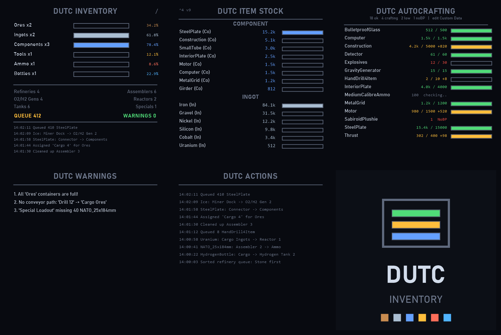

# DUTC Inventory Manager

All-in-one inventory manager script for **Space Engineers** programmable blocks.
Sorting, autocrafting, turret ammo, bottle refilling, refinery/ice/uranium
balancing and sprite-drawn LCDs — fully backward compatible with Isy's
Inventory Manager setups and safe alongside Nanobot Build & Repair.

**➡ Subscribe on the [Steam Workshop](https://steamcommunity.com/sharedfiles/filedetails/?id=3789969690)**



## Features

- Item sorting into type containers: Ores / Ingots / Components / Tools / Ammo / Bottles / Food
- Even balancing of every item across same-type containers
- Turret + fixed gun ammo loading (subgrids and docked ships included)
- Autocrafting driven by the Autocrafting LCD's Custom Data, with deep modded-blueprint discovery
- Assembler feeding (ingots pre-stocked for the queue), refinery feeding + ore balancing, ice + uranium balancing
- Bottle refilling through tanks — including bottles already in storage
- Multi-instance election (base + docked ship each running the script pick one active manager)
- Build Planner safe: the script only ever cancels queue entries it created itself
- Sprite LCD UI with auto-scroll, pixel-based layout (vertical screens supported), UI_SCALE option
- Big-base safe: chunked scanning, cached conveyor path checks, budgeted + resumable blueprint sweeps, results persisted in Storage

## Repository layout

| Path | Purpose |
|---|---|
| `src/00_config.cs` | All user settings (keywords, toggles, thresholds) — kept commented in the build |
| `src/01_main.cs` | State, entry point, step machine, Storage persistence |
| `src/02_scan.cs` | Block scanning (chunked), counting, container auto-assignment |
| `src/03_sort.cs` | Item sorting, container balancing, special containers |
| `src/04_craft.cs` | Autocrafting, blueprint discovery, crafting screen |
| `src/05_machines.cs` | Refineries, ice, uranium, turrets, assembler feeding, cleanup |
| `src/06_screens.cs` | Sprite LCD rendering |
| `src/07_helpers.cs` | Shared helpers (transfer engine, caches, classification) |
| `build.ps1` | Merges the modules into `DutcInventory_paste.cs` (comment-stripped, config kept) |
| `DutcInventory_paste.cs` | The built file — paste this into the Programmable Block |
| `Description.bbcode.txt` | Master copy of the Steam Workshop description |

## Building

```powershell
powershell -ExecutionPolicy Bypass -File build.ps1
```

Merges `src/*.cs` in filename order, strips comments outside the config module,
checks the 100k character PB limit and brace balance, and copies the result to
your clipboard.

Scripts are C# 6 (the Programmable Block compiler): no local functions, no
pattern matching, no `?.` on game interfaces you don't control. Final compile
verification happens in game via **Check Code**.

## Contributing

Bug reports and patches are very welcome — this script has been shaped heavily
by community testing and diffs. Open an issue or PR here, or post in the
[Workshop discussions](https://steamcommunity.com/workshop/filedetails/discussions/3789969690)
where most of the debugging happens. Credit is given in changelogs.

Thanks to **aantono**, **Oxnard**, **VFox32** and **seversti** for fixes,
diagnosis and relentless testing.
